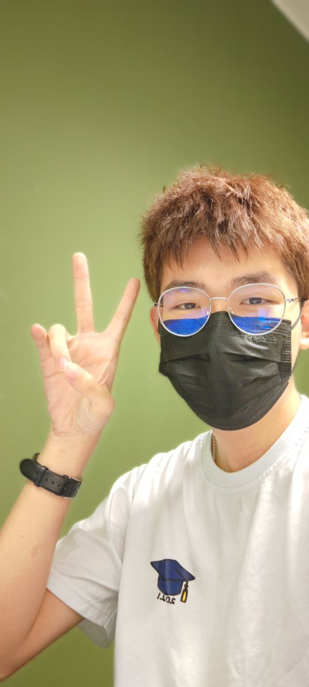
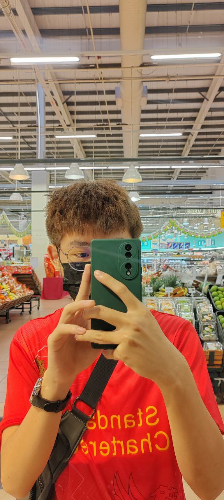
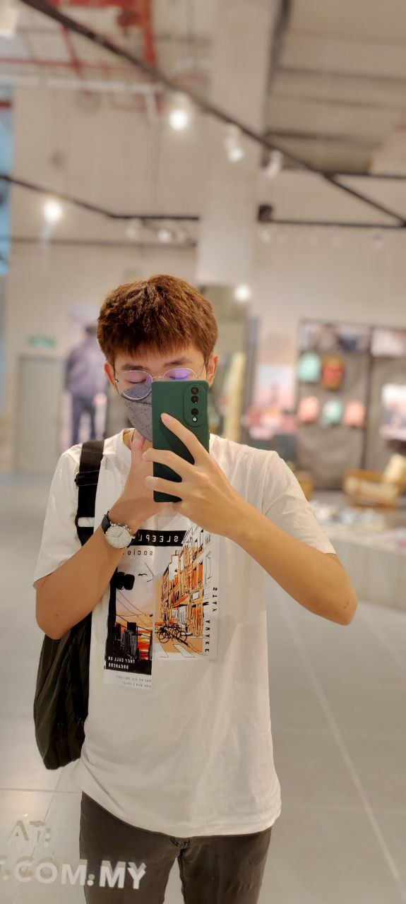
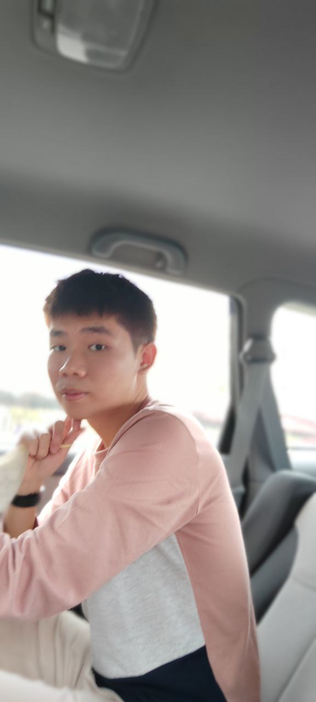
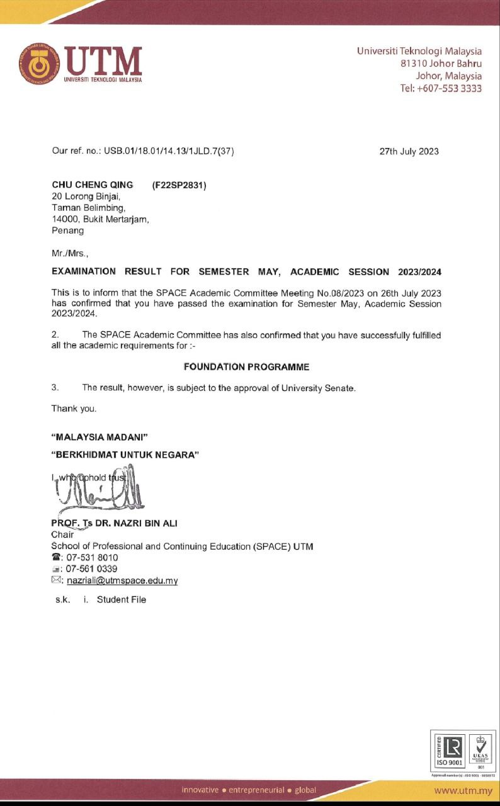
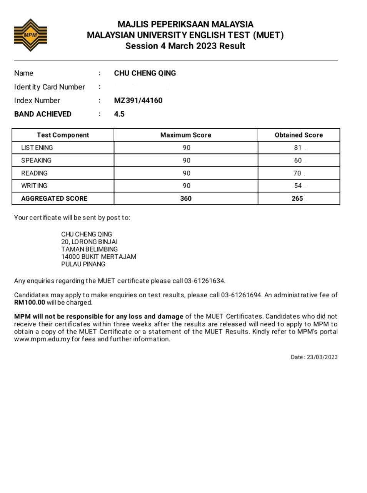
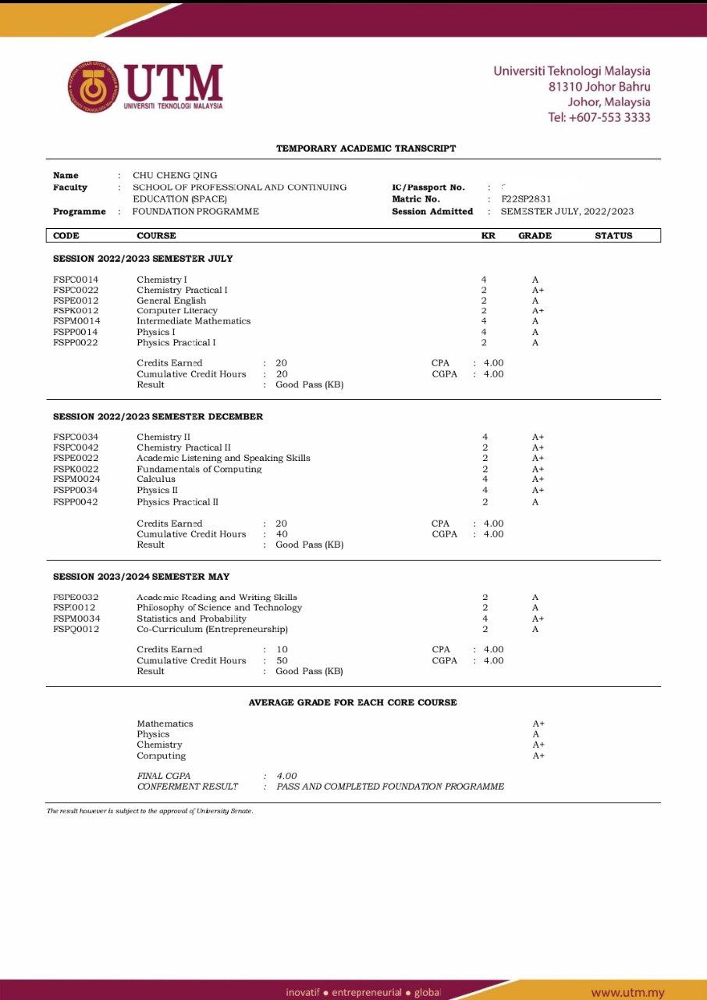
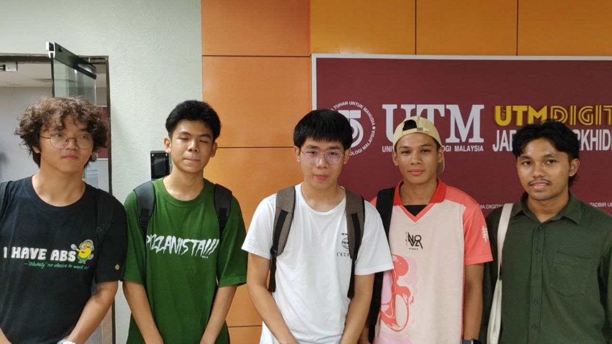
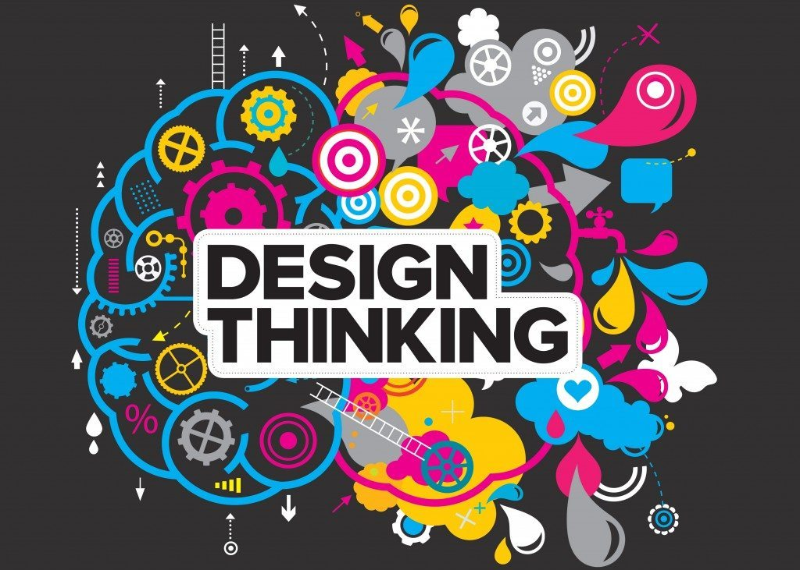

# Github Eportfolio

This is an electronic portfolio (e-portfolio). In this portfolio, I'll showcase the sample of collection of my work, demonstrations, and artifacts that showcase my learning progression, achievement, and evidence of what I can do. 

Hi My name is CHU CHENG QING
======================================================================================================================================

A uni student in Software Engineering
-------------------------------------
#### Here are some pictures about me

* 🌍  I'm based in Bukit Mertarjam, Penang
* ✉️  You can contact me at [chuqing@graduate.utm.my](mailto:chuqing@graduate.utm.my)
* 🧠  I'm learning Software engineering

## 🛠 Skills
C++, Python...

## Education
Before this, I graduated in the pre-U program "UTM FOUNDATION IN PHYSICAL SCIENCE" offered by UTM SPACE
### Certificates & Qualifications

## Assignments

Here are some of my assignments

- [ASSIGNMENT 1 : REPORT ON VISIT TO NALI 2023](https://github.com/CQ0113/Eportfolio/blob/main/TIS%20ASSIGNMENT%201%20(GRP%204)%20(3).pdf)

#### Reflection 1

The visit provided valuable insights into the integration of Information and Communication Technology (ICT) in teaching and learning. Witnessing the diverse range of technological tools and innovative teaching methods showcased during the visit emphasized the transformative potential of ICT in education. The experience highlighted the importance of ongoing professional development for educators and underscored the need to address challenges associated with equitable access to technology. Overall, the visit has broadened my perspective on the role of ICT in education and inspired a commitment to incorporating technology in future teaching practices for a more engaging and student-centered learning environment.

- [ASSIGNMENT 2 : POSTER ON INDUSTRIAL TALK 1](https://github.com/CQ0113/Eportfolio/blob/main/Tis%20Assign%202%20poster.jpg)

#### Reflection 2
In this assignment, we delved into the world of ICT jobs by creating a poster that highlights the diverse roles within Clarity Network. This exploration provided us with valuable insights into the specific job scopes of various positions within the ICT industry. Through this experience, we have gained a clearer understanding of the exciting possibilities that await us in the future, shaping our vision of the roles we may undertake in the dynamic field of information and communication technology."

- [ASSIGNMENT 3 : VIDEO ON VISIT TO UTMDIGITAL AND THE ATTENDED VIRTUAL TALK](https://github.com/CQ0113/Eportfolio/blob/main/TIS%20ASSIGN%203%20%20GRP%204%20(1).pdf)

#### Reflection 3
In the course of this assignment, we had the opportunity to explore UTM Digital, gaining deeper insights into its inner workings. Our exploration extended to understanding the intricacies of the WiFi infrastructure, server operations, and various components that contribute to the seamless functioning of the organization. Immersing ourselves in the working environment, we not only familiarized ourselves with the technical aspects but also gained valuable insights into problem-solving methodologies employed by the team. This firsthand experience provided us with a comprehensive understanding of job scopes, enabling us to appreciate the diverse skills required to navigate the challenges within UTM Digital.

- [ASSIGNMENT 4 : REPORT ON INDUSTRIAL TALKS 2A](https://github.com/CQ0113/Eportfolio/blob/main/GROUP4%20INDUSTRIAL%20TALK%202.pdf)

#### Reflection 4

In this assignment, I got to know that becoming a successful system developer requires a effective approach, blending both hard and soft skills. I will prioritize honing my programming proficiency, understanding system architecture, and mastering relevant technologies. Concurrently, I'll focus on developing soft skills like effective communication and teamwork. Actively engaging in internships and specialized programs will provide hands-on experience, allowing me to apply theoretical knowledge to real-world scenarios. To ensure success, meticulous planning is essential. I'll create a timeline, set achievable goals, and continuously assess my progress. This proactive approach will enable me to stay on track, adapt to emerging trends, and ultimately become a highly skilled and sought-after system developer. 

- ASSEMBLE PC LAB

#### Reflection
In this lab, we delved into the hands-on experience of assembling a PC, deepening our understanding of its intricate components. Through this immersive process, we not only acquired practical skills in assembling a computer but also gained comprehensive insights into the fundamental building blocks that power these technological marvels. This firsthand exploration has not only expanded our knowledge but has also equipped us with a practical understanding of the synergy among the various components within a PC. As we navigated through the intricacies of PC assembly, we discovered the significance of each component, contributing to a richer and more profound comprehension of the technology that drives modern computing.

- [Design Thinking](https://github.com/CQ0113/Eportfolio/blob/main/TIS%20FINAL%20PROJECT.pdf)

#### Reflection
In this project, I've gained invaluable insights into the design thinking process, discovering its structured approach to problem-solving. Learning the nuances of empathizing with user needs, ideating creative solutions, and embracing iterative refinement has been a transformative experience. Applying design thinking methodologies to solve real-world problems has not only honed my problem-solving skills but has also instilled the importance of adaptability and continuous improvement. The iterative nature of design thinking has taught me the value of flexibility in responding to evolving insights and user feedback. As I conclude this project, I carry forward a comprehensive toolkit for future challenges, equipped with the ability to empathize deeply, think creatively, and iteratively refine solutions – skills that extend beyond this project and are integral to my approach to problem-solving in both academic and professional contexts.
